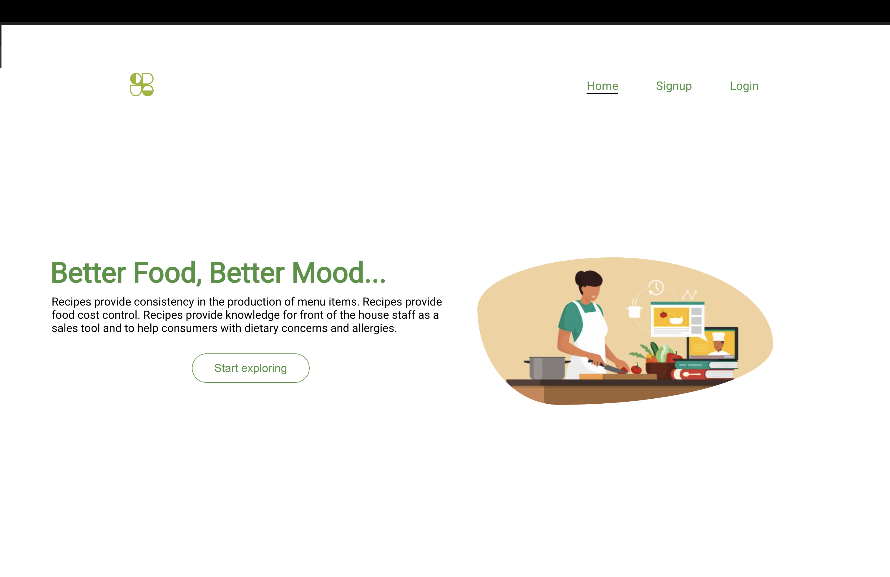

# Recipe-App

## Project Description:
Recipe web app lets users create, search, update, and delete recipes with personalized dashboards, user sign up and login. Save unique recipes and store personal ones for others to see. Browse thousands of recipes or create your own. Share favorites with friends and family. Sign up today and start cooking!

 ### App Preview

## Built with
- [React](https://react.dev/)
- [Node JS](https://nodejs.org/en)
-  [MongoDB](https://www.mongodb.com/atlas/database)
- [Express](https://expressjs.com/)
- [Netlify](https://app.netlify.com/)
- [Cyclic](https://app.netlify.com/)

## Getting Started 

### Prerequisites

- Clone the repo

- npm  install

- npm start - [to start frontend ]
